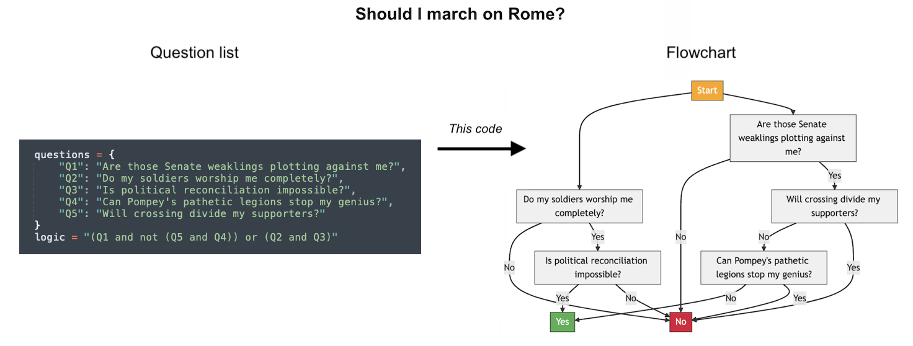
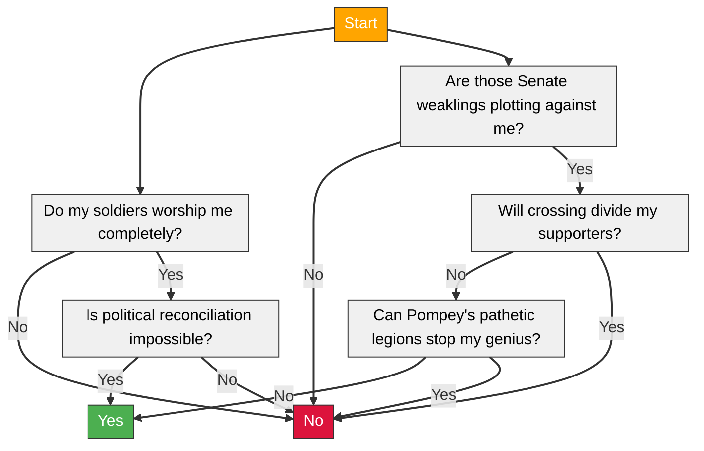

# Boolean Expression to Flowchart Converter




## Motivation

There are two ways to represent a criteria set. The first approach uses a flowchart where questions are linked via indices for "Yes" and "No" answers, forming a directed acyclic graph that terminates in either "Approve" or "Reject" nodes. The second approach uses a list of questions plus a boolean expression (e.g., a line of Python code with boolean operators and variables like "Q1", "Q2", etc.) that returns either "True" (Accept) or "False" (Reject).

The boolean expression approach offers significant advantages in terms of simplicity and maintainability. It eliminates the need for graph validation and complex traversal logic, making it easier to debug and modify. Adding or removing questions becomes a matter of updating a single expression rather than rewiring graph connections. The code is more maintainable and easier to serialize.

While this approach requires evaluating all questions (typically negligible with 6-20 questions) and cannot represent certain complex merging patterns, these limitations rarely matter in practice. The main potential drawback is that boolean expressions may be less intuitive for some users compared to flowchart visualizations. This tool bridges that gap by allowing you to maintain the simpler boolean logic internally while generating clear visuals or DAGs when needed.

## How to Use

By default, running `python flowchart.py` outputs Mermaid flowchart syntax:

```
%%{init: {'flowchart': {'rankSpacing': 25, 'nodeSpacing': 50, 'padding': 5}}}%%
flowchart TD
Start["Start"]
Q5["Will crossing divide my supporters?"]
Q2["Do my soldiers worship me completely?"]
Q3["Is political reconciliation impossible?"]
Q4["Can Pompey's pathetic legions stop my genius?"]
Q1["Are those Senate weaklings plotting against me?"]
Approve["Yes"]
Deny["No"]
Start --> Q2
Start --> Q1
Q2 -->|No| Deny
Q3 -->|Yes| Approve
Q4 -->|No| Approve
Q3 -->|No| Deny
Q1 -->|No| Deny
Q1 -->|Yes| Q5
Q4 -->|Yes| Deny
Q5 -->|No| Q4
Q5 -->|Yes| Deny
Q2 -->|Yes| Q3
classDef default fill:#f0f0f0,stroke:#333,stroke-width:1px,color:black
classDef start fill:#FFA500,stroke:#333,color:white
classDef approval fill:#4CAF50,stroke:#333,color:white
classDef rejection fill:#DC143C,stroke:#333,color:white
class Start start
class Approve approval
class Deny rejection
linkStyle default stroke:#333,stroke-width:2px
```

You can visualize this by pasting it into [Mermaid Live](https://mermaid.live), which will render:



Running `python flowchart.py --dag` outputs a JSON representation instead:

```json
{"nodes":{"Start":"Decision Point"},"edges":{"Start":{"Start":["Q2","Q1"]},"Q5":{"No":["Q4"],"Yes":["Deny"]},"Q2":{"Yes":["Q3"],"No":["Deny"]},"Q4":{"No":["Approve"],"Yes":["Deny"]},"Q3":{"No":["Deny"],"Yes":["Approve"]},"Q1":{"No":["Deny"],"Yes":["Q5"]}},"terminal_nodes":{"Approve":"Yes","Deny":"No"}}
```

You can also input custom questions and boolean expressions. Here is an example for the question "Should I bring an umbrella":
```bash
python flowchart.py --questions '{"Q1": "Is it raining?", "Q2":"Am I wearing a raincoat?", "Q3":"Am I walking to work?", "Q4":"Are there places to shelter?"}' --expr "(Q1 and Q3) or (not Q2 and not Q4)"
```

## Technical Details

**Disjunctive Normal Form.** [Disjunctive Normal Form](https://en.wikipedia.org/wiki/Disjunctive_normal_form) (DNF) is a way of representing boolean logic that breaks complex logical expressions into simpler, more manageable parts. In DNF, a boolean expression is converted into a series of clauses connected by OR operations where each clause is a combination of terms connected by AND operations. It's often used for automated theorem proving. In this script, we use DNF conversion to break down complex decision rules into a set of paths through the decision tree. By converting the boolean expression to DNF, we can put together a set of paths that lead from the start node to one of the termination nodes. This transformation ensures that even intricate logical conditions can be represented as a straightforward graph.

**Limitations.** The script can handle any non-merging DAG and most merging DAGs where the merges only affect the final outcome. It cannot represent cases where the path history influences decisions after a merge point, though this is rarely needed in practice.
